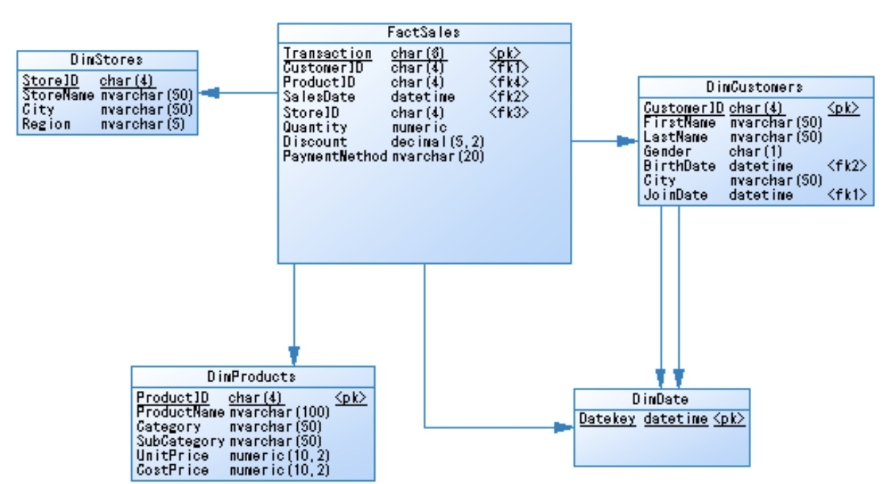

# Retail Sales Data Warehouse & Analytics Project

## Project Overview
This project focuses on designing and implementing a **Retail Sales Data Mart** to support sales performance analysis and data-driven decision-making.  
The project covers the full analytics lifecycle, from business requirement analysis and data modeling to ETL, BI dashboards, and advanced analytics.

The Data Mart enables executives and analysts to gain insights into sales performance, customer behavior, product profitability, and the impact of discounts and promotions.

This project was completed as a **group analytics project**.

---

## Business Objectives
The main objective of this Data Mart is to support **Sales Performance Analysis**, allowing business users to:
- Monitor revenue and profit
- Identify top-performing products, stores, and customer segments
- Analyze sales trends over time
- Understand the impact of discounts and payment methods on sales and profitability

---

## Business Questions
The Data Mart is designed to answer the following key business questions:

- Which branch generated the highest sales in 2023, and what are the best-selling products of each branch?

- Which product categories are the main revenue drivers of the company during the operating period (2023–2025)?

- Which customer segment generates the highest value for the company and should be prioritized in marketing efforts?

- What are the current behaviors of “At-Risk” customers, and how can they be developed to generate sustainable revenue?

---

## Data Mart Design
A **Star Schema** was selected for this Data Mart because it is:
- Easy to understand
- Optimized for analytical queries
- Well-suited for BI dashboards

 

---

## Database Implementation (SQL Server)
The database was generated in **Microsoft SQL Server (localhost)** using the data source:

- **Database Name**: `RetailDataMart`

Steps:
1. Generated database tables from the physical diagram
2. Created fact and dimension tables
3. Defined primary keys and foreign key constraints
4. Imported data from Excel files into SQL Server using the Import Wizard

📌 SQL scripts for database creation are available in the `/sql/` folder.

---

## ETL & Data Preparation (Tableau Prep Builder)

📌 *Insert Tableau Prep workflow screenshot here*

---

## Business Intelligence Dashboards (Tableau Desktop)
Two dashboards were created to visualize business insights:

1. **Retail Sales & Customer Overview**
   - Sales trends
   - Revenue and profit KPIs
   - Performance by product, store, and region

2. **RFM Dashboard**
   - Customer segmentation based on Recency, Frequency, and Monetary value

📌 *Insert Tableau Dashboard screenshots here*

> Dashboard development was completed as part of the group collaboration.

---

## Advanced Analytics (RapidMiner / Altair AI Studio)

### 1. Linear Regression
**Objective:**  
To analyze whether UnitPrice, Quantity, and Discount affect Profit.

**Model Equation:**  
Profit = 0.89 × UnitPrice + 346.75 × Quantity − 957.68

- UnitPrice and Quantity significantly impact Profit
- Discount was excluded due to low variance (Std ≈ 0.057)

**Performance Metrics:**
- R² = 0.726  
  → 72.6% of profit variation is explained by the model
- RMSE = 434.94  
  → Average prediction error of approximately 435 units

---

### 2. Decision Tree Regression
**Objective:**  
To identify key factors influencing Total Revenue.

**Key Results:**
- Most influential variable: Discount (weight = 0.639)
- Second most influential: Profit (weight = 0.336)
- Other factors (ProductID, Date, BirthDate) have minimal impact

**Performance Metrics:**
- RMSE = 137.74
- Relative Error = 3.00%
- R² = 0.996

---

### 3. K-Means Clustering
Customers were segmented into **3 clusters** using:
- UnitPrice
- Quantity
- TotalRevenue  
(Max runs = 10)

**Customer Segments:**
- **Cluster 0**: Price-sensitive customers  
  → Best targeted with discounts and promotions
- **Cluster 1**: High-value customers  
  → Suitable for VIP programs and loyalty benefits
- **Cluster 2**: Premium customers  
  → Prefer quality over quantity, ideal for premium offerings

This segmentation supports more effective **targeted marketing strategies**.

---

## Tools & Technologies
- **Database**: Microsoft SQL Server
- **Data Modeling**: PowerDesigner
- **ETL / Data Preparation**: Tableau Prep Builder
- **BI & Visualization**: Tableau Desktop
- **Advanced Analytics**: RapidMiner (Altair AI Studio)

---

## Key Learning Outcomes
- Designed and implemented a Star Schema Data Mart
- Built ETL workflows for data integration and transformation
- Developed interactive BI dashboards for business insights
- Applied regression, decision tree, and clustering techniques
- Gained hands-on experience in an end-to-end analytics project
